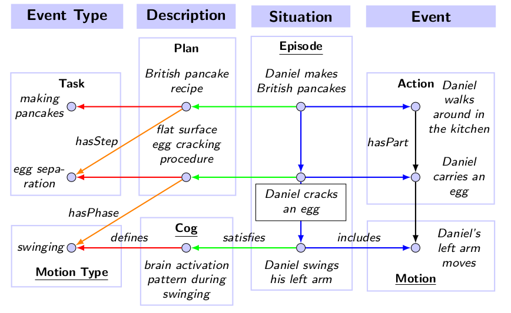

\page semweb Semantic Web

### Knowledge Graphs

Triples are the basic building blocks of the RDF data model.
A triple is a statement that consists of three parts: a subject, a predicate, and an object.
The subject is the resource being described, the predicate is the property of the resource,
and the object is the value of the property.
For example, the triple `ex:John ex:hasAge "25"^^xsd:integer` states that the resource
`ex:John` has the age of `25`.
A collection of triples forms an RDF graph, which is a set of subject-predicate-object triples.

While the term "triple" is widely used, most of the triple stores in fact support an additional
fourth element, usually called the "graph" or "origin" of the triple, which is used to distinguish
between different named graphs. In such a case, the triple is actually a quadruple and often
referred to as a "quad".

However, in KnowRob, we consider additional context parameters as part of the triple itself.
Such a triple with context parameters is referred to as `FramedTriple` within KnowRob.
This is done to cope with uncertain statements, and statements that are only valid in a certain context (or frame).
Nevertheless, KnowRob can make use of any quad store by internally *reifying* the contextualized triple
into a set of triples without context parameters (see `StorageInterface`).

#### Context Parameters of Triples

The following table lists the context parameters that can be used in a `FramedTriple`:

| Parameter     | Description                                                                  |
|---------------|------------------------------------------------------------------------------|
| `graph`       | The graph or origin in which this triple is loaded  (default: user).         |
| `perspective` | The perspective from which this triple is valid (default: ego).              |
| `uncertain`   | A flag indicating if this triple is uncertain (default: false).              |
| `occasional`  | A flag indicating if this triple is only occasionally true (default: false). |
| `confidence`  | The (normalized) confidence that this triple is true (default: 1.0).         |
| `begin`       | The begin time of the validity of this triple (default: -inf).               |
| `end`         | The end time of the validity of this triple (default: +inf).                 |

Each of these parameters is optional in queries.
Some additional comments on the context parameters:
- A triple can be asserted into multiple origins. 
- The "perspective" parameter can be e.g. the IRI of another agent.
The default case is the "ego perspective" which is the perspective of the agent that runs the knowledge base.

#### Triple Patterns

A triple pattern is a triple with some parts replaced by variables.
For example, the triple pattern `?x ex:hasAge ?y` matches all triples where the predicate is `ex:hasAge`.
Triple patterns are used in queries to match triples in the knowledge base.
The query engine then binds the variables in the triple pattern to the actual values in the triples.

In KnowRob, triple patterns are represented by the `TriplePattern` class.
It uses terms to represent the subject, predicate, object, and context parameters of the triple.
Each of the terms can either be a variable or a constant term.
In addition, a few comparison filters can be specified to restrict matching triples.
Once a triple pattern is created, it can be used to query the knowledge base for matching triples.
Given the `Bindings` obtained from the query, the triple pattern can be instantiated to a `FramedTriple`.

#### Graph Queries

More complex graph queries can be formed over triple patterns by introducing additional operators.
Triple stores usually support connective operators `UNION` and `PATH` to combine multiple triple patterns.
In KnowRob, the `GraphQuery` class is used to represent such more complex graph queries.
It has the subtypes `GraphUnion` and `GraphSequence` to represent the `UNION` and `PATH` operators, respectively.
In addition, the `GraphBuiltin` class is used to represent built-in operators that are not part of the RDF standard.

The builtin operators that must be supported by backends include the `BIND` operator for variable assignment and
the `FILTER` operator for filtering results. In addition, a `MAX` and `MIN` operator is needed that binds
a variable to the maximum or minimum value of a set of values, respectively.
These operators are mainly required to support the context parameters of `FramedTriple` with
storage backends that cannot store them directly.

### Ontologies

KnowRob supports the Resource Description Framework (RDF) which is similar to
classical modelling approaches such as entity-relationship and class diagrams.
In the RDF model, statements about *resources* can be represented
in form of *subject-predicate-object* triples that express a relationship
between subject and object of the triple.
In particular KnowRob considers the following vocabularies:
*XML Schema Data Types* (XSD), *RDF Schema* (RDFS), and *Web Ontology Language* (OWL).

#### Ontology Languages

RDFS is an ontology language that can be used to represent *taxonomies*
through *subClassOf* and *subPropertyOf* relationships.
It further allows to define the *domain* and *range* of properties --
i.e. what type of subject can be the host the property,
and what type of object can be the value of it.
OWL is another ontology language, but more expressive than RDFS.
Please refer to the [OWL2 overview](https://www.w3.org/TR/owl2-overview/) for
complete information about it.
The OWL language supports some more advanced class relationships such as
*intersectionOf* and *complementOf*, property cardinality restrictions,
and additional property characteristics such as *inverse* and *functional*
properties.
However, a dedicated reasoner is required to infer new knowledge from OWL ontologies.

#### Ontology Organization

KnowRob ships with a set of OWL ontologies organized
into upper-level, domain and application ontologies.

A *upper-level ontology* (also called foundational ontology) defines
concepts that are useful across disciplines such as event and object,
and general relations such as parthood and participation. 
KnowRob uses the [DOLCE+DnS Ultralite](http://ontologydesignpatterns.org/wiki/Ontology:DOLCE+DnS_Ultralite) (DUL) upper-level ontology which is a
*"lightweight, easy-to-apply foundational ontology for modeling either physical or social contexts"*. 

A *domain ontology* is used to fix general terms in some domain.
The domain KnowRob was designed for is *everyday activities*.
KnowRob ships with the
[Socio-physical Model of Activities](https://github.com/ease-crc/soma) (SOMA)
ontology which derives its notions from the DUL upper-level.
However, it is possible to configure KnowRob for other discipines by
using different domain ontologies.
Another domain ontology in KnowRob has the scope 
to capture categories underying robot control.
This includes the concepts sensor, actor, and capability.

Finally, an *application ontology* includes all application-specific definitions.
As KnowRob is a general framework, no such ontology will be auto-loaded by default.
However, some application ontologies are available as part of public
[repositories](https://github.com/knowrob/),
and hosted by the [openEASE webservice](http://www.open-ease.org/).

#### Ontology Alignment

*Ontological alignment* is
the problem of aligning two or more ontologies,
or parts of ontologies, in order to enable interoperability between them.

Within KnowRob, the goal is to align external ontologies with the KnowRob ontology,
so that data from external sources can be integrated.
This is a crucial step in enabling KnowRob to reason over data from the web,
and to integrate data from different sources.
See `GraphTransformation` for more information on how ontologies can be aligned in KnowRob.

#### Activity Model

In KnowRob, an *Action* is defined as an *Event* where at least one agent that participates in the
event executes a *Task* which is typically defined in a *Plan*. Tasks are used to classify actions,
similar to how roles are used to classify objects within some situational context.
There may be multiple plans defining the same task which is useful to capture different ways to
achieve the same goal. The distinction between *Action* and *Task* is further important as it
enables us to put individual tasks into discourse without referring to a particular execution of
them (i.e. an *Action*). This is needed because a *Plan* is a generalization of action executions,
abstracting away from individual objects that were involved by only referring to the roles they have played.

*Plans* are used to structure tasks, asserting how they are composed of steps and in
which order they should be executed. KnowRob supports relations from Allen's Interval
Algebra to assert ordering constraints between steps, and also allows to only specify
partial ordering. Each step of a plan is a task itself, and may also be defined by some plan(s).
However, the action model of KnowRob allows to go deeper by decomposing a task into *phases*.
A phase is a *Process* or *State* that occurs during task execution which includes force dynamic
events, and motions. Processes are classified by one of the *ProcessType* concepts, and states
are classified by one of the *Gestallt* concepts defined in the model.

**Roles** are used to classify objects that participate in some event.
This includes the agent that performed the action, tools that were used,
objects that were affected, as well as locations of interest.
KnowRob defines a taxonomy of roles with the most general concepts including
*Patient*, *Instrument*, and *Location*.

